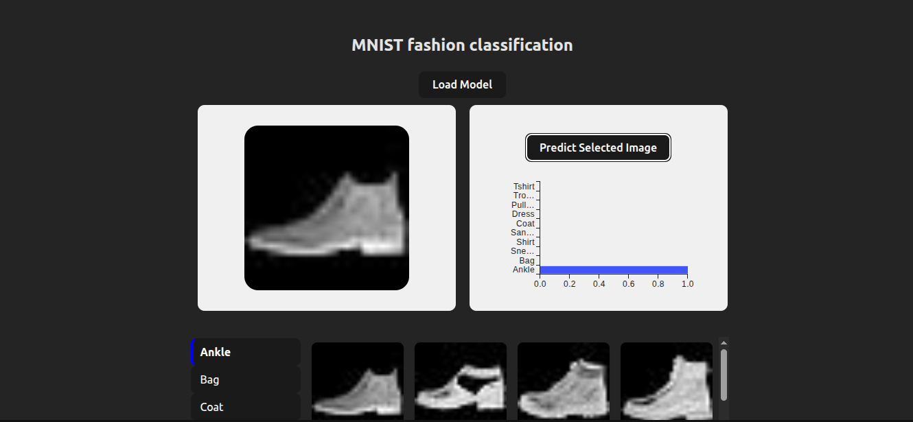

# 🧠 Fashion MNIST Classifier with TensorFlow & React

A modern web app to explore and visualize deep learning predictions on the **Fashion MNIST dataset**, combining powerful backend training with an elegant frontend interface.


## 📌 Project Overview

This project explores and compares different deep learning architectures for classifying clothing images from the Fashion MNIST dataset. Models were trained using **TensorFlow (Python)** and then converted to **TensorFlow\.js** for real-time predictions in the browser.

### 🎯 Objective

Evaluate how different techniques — like **Batch Normalization**, **Dropout**, and **Learning Rate Scheduling** — affect training and performance.



## 📊 Model Comparison Table

| Model                        | Train Loss | Train Accuracy | Val Loss | Val Accuracy |
|-----------------------------|------------|----------------|----------|--------------|
| Baseline                    | 0.2280     | 0.9237         | 1.3741   | 0.8652       |
| BatchNorm                   | 0.0179     | 0.9943         | 0.8862   | 0.8894       |
| Dropout + BatchNorm         | 0.0576     | 0.9801         | 0.5158   | 0.8992       |
| Dropout + BN + LR Scheduler | 0.0303     | 0.9892         | 0.5414   | 0.9052       |

✅ Regularization techniques like Batch Normalization and Dropout significantly improved generalization. The best results were obtained by combining them with a learning rate scheduler, achieving the highest validation accuracy (90.52%) and stable training performance.


## 🌐 Frontend Features (React + TensorFlow\.js)

* 📷 **Image Grid**: Browse Fashion MNIST test images
* 🔍 **Click-to-Predict**: Select an image and view class prediction
* 📈 **ChartBar**: Visualize class probabilities with Chart.js

## 🚀 Live Demo

> 🖥️ [Try the App on Vercel](https://mnist-fashion-classification.vercel.app/)

## 📦 Run Locally

```bash
# 1. Clone the repo
git clone https://github.com/angelTCC/MNIST-fashion-classification.git
cd MNIST-fashion-classification
cd mnist-fashion-classification

# 2. Install dependencies
npm install

# 3. Start the dev server
npm run dev
```

## 📄 License

MIT — free to use, modify, and share.

